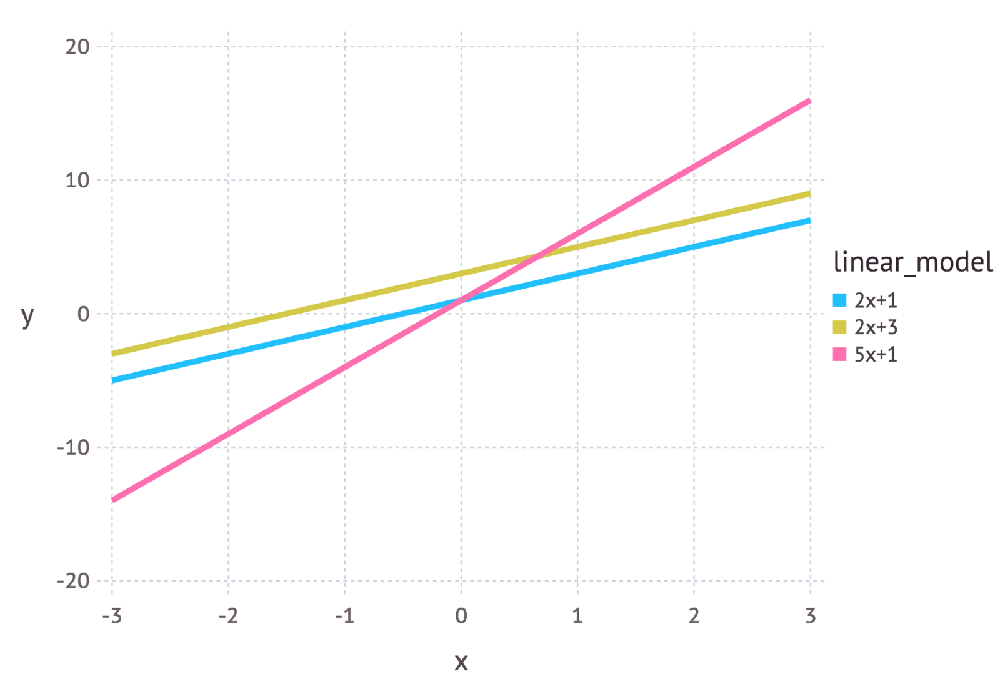

# 概率基础知识
来自数据科学家`Jonny Brooks-Bartlett`撰写的一系列概率论入门教程。

## 1. 基本概念
这么些年来，我读过很多关于概率论各个方面的文章，每篇文章看起来都需要不同级别的预备知识才能理解。我绝非这个领域的专家，但我觉得自己可以贡献一系列文章。我希望这些文章可以解释许多有关概率的概念。本文将是这个系列的第一篇，我将介绍一些基本定义。

### 1.1 定义和符号
通常概率至少和一个事件有关。这个事件可以是任何事。最简单的例子包括投骰和从口袋中抓取有颜色的球。在这些例子中，事件的结果是随机的(投骰时无法确定最终的点数)，所以表示这些事件的结果的变量称为随机变量(常常缩写为$RV$)。

我们常常想知道一个随机变量取一个特定值的概率。例如，投掷一个均质的6面骰时，点数是3的概率是多少？“均质”一词很重要，因为它告诉我们骰子落地时6个面(1、2、3、4、5、6)朝上的概率是相等的。从直觉上，你也许会说答案是$\frac{1}{6}$。没错！但我们如何以数学的形式表达这个呢？好，首先我们需要了解这里的随机变量是与投骰相关的事件结果。通常，随机变量用大写字母表示，这里，我们用$X$表示。所以，我们想知道$X=3$的概率。但是数学家写东西的时候可懒了，概率是多少？简写为字母$P$。因此，“当我投一个均质的6面骰时，点数为3的概率是多少？”，在数学上记作$P(X=3)$。

### 1.2 概率的3种类型
我们上面介绍了随机变量和概率的一些记法。然而，概率可能会变得非常复杂。也许首先需要理解的是概率有不同的类型：
- **边缘概率(Marginal Probability)**：事件A的边缘概率为A发生的概率$P(A)$。例子：从一副扑克牌中抽出一张红色的牌的边缘概率是$P(红) = 0.5$
- **联合概率(Joint Probability)**：两个以上事件的交集的概率。我们可以用文氏图(Venn Diagram)可视化这一概念，我们用两个圆代表两个事件，两个圆重叠的部分即为联合概率。(见下图)事件A和B的联合概率写作$P(A ∩ B)$。例子：从一副扑克牌中抽出一张红色的4的概率为$P(红4) = \frac{2}{52} = \frac{1}{26}$。(一副扑克牌有52张牌，想抽到的是红心4和方块4)。后面我们会详细讨论这个例子。
- **条件概率(Conditional Probability)**：条件概率是已知某(些)事件已经发生的前提下，另一(些)事件发生的概率。已知事件B已经发生时，事件A发生的条件概率写作$P(A|B)$。例子：已知我们抽到了一张红色的牌，这张牌是4的概率为$P(4|红) = \frac{2}{26} = \frac{1}{13}$ (一副扑克牌有52张牌，26张红色的，26张黑色的。现在因为我们已经抽到了一张红色的牌，我们知道我们抽取的范围是26张牌，因此第一个除数是26)。

*文氏图的重叠之处表示联合概率，也就是事件A和事件B同时发生的概率。如果事件之间没有重叠，那么联合概率将是零*

#### 1.2.1 连接概率类型：乘法法则
乘法法则是一个连接所有3种概率类型的美丽等式：
- $P(A|B) = \frac{P(A∩B)}{P(B)}$

#### 1.2.2 例子的进一步解释
有时候联合概率和条件概率的区别相当令人困惑，所以让我们尝试用抽扑克牌的例子来理解两者的区别。

当我们想要知道抽到一张红色的4的扑克牌的概率(红色和4的联合概率)时，我想让你想象一下，把所有52张牌面朝下放置，然后随机选中一张。在这52张牌中，有2张是红色的，同时数字是4(红心4和方块4)。所以联合概率是$\frac{2}{52} = \frac{1}{26}$。

而当我们想要知道已知抽中的牌是红色的时候，抽中数字是4的牌的概率，即条件概率$P(4|红)$时，我想让你再想象一下有52张牌。不过，在随机抽取一张牌之前，你给所有扑克牌排了个序，选中了所有26张红色的牌。现在你把这26张牌面朝下放置，然后随机选择一张牌。同样，这些红色的牌中有两张数字为4，所以条件概率是$\frac{2}{26} = \frac{1}{13}$。

如果你偏好数学，那我们也可以转而使用上面定义的乘法法则来计算联合概率。我们首先整理一下等式，让联合概率$P(A ∩ B)$成为等式的主题(换句话说，我们把$P(A ∩ B)$放到等号的左边，把其他项都放到等号的右边)。重新整理后，我们得到$P(A ∩ B) = P(A|B) * P(B)$。让我们设定事件A是牌的数字为4的事件，事件B是牌的颜色是红色的事件。如前所述，$P(A|B) = \frac{1}{13}$，而$P(B) = \frac{1}{2}$(一半的牌是红色的)。因此$P(A ∩ B) = \frac{1}{13} * \frac{1}{2} = \frac{1}{26}$。

### 1.3 概率法则：`和`与`或`
#### 1.3.1 和
在联合概率中，我们已经遇到过“和”的情况，然而，我们并不知道如何计算“和”的概率。所以让我们来看一个例子。

假设我们有两个事件：事件A——抛掷一枚均质的硬币，事件B——投掷一枚均质的骰子。我们也许会想知道骰子的点数是6而硬币正面朝上的概率。所以，为了计算骰子点数为6和硬币正面朝上的概率，我们可以把上面的乘法法则重新整理一下$P(A ∩ B) = P(A|B) * P(B)$。我们知道事件A是丢硬币而事件B是扔骰子。因此$P(A|B)$意味着“当我们已经扔出一枚点数为6的骰子时，抛出一枚正面朝上的硬币的概率”是多少？”

直觉告诉我们，丢硬币与扔骰子无关。这两个事件是`独立(independent)事件`。在这个场景下，不管骰子的点数是多少，丢硬币得到的结果都是一样的。数学上我们将其表达为$P(A|B) = P(A)$。**因此，当事件相互独立时，联合概率为独立事件的边缘概率的乘积：$P(A ∩ B) = P(A) * P(B)$**。因此$P(硬币正面朝上和骰子点数为6) = P(A=正面, B=6) = \frac{1}{2} * \frac{1}{6} = \frac{1}{12}$。

*注意：上面的$P(A=正面, B=6)$，事件之间的逗号是联合概率的简写*。

值得注意的是，在现实世界的场景中，事件被假定为独立的（即使事实上并非如此）。这主要是因为，假定事件是独立的大大简化了数学。附带的好处是所得的结果通常很有用。在数据科学中，朴素贝叶斯可能是这方面最常见的例子。朴素贝叶斯通常能很好地处理文本分类问题。

#### 1.3.2 或
在“和”法则中，我们将单独概率相乘。在“或”的场景下，我们需要将单独概率相加，然后减去交集。在数学上，我们将其写作$P(A ∪ B) = P(A) + P(B) - P(A ∩ B)$。你可能会问，为什么我们要这么做？好吧，让我们回顾一下上文中的文氏图。如果我们把A圆和B圆相加，那么其中的重叠部分算了两次。因此，我们需要减去交集。

所以，让我们把上面的例子改成寻找投出点数为6的骰子或扔出正面向上的硬币的概率，即$P(硬币正面向上或骰子点数为6) = P(A=正面 ∪ B=6) = \frac{1}{2} + \frac{1}{6} - \frac{1}{12} = \frac{7}{12}$。

*注意：我们使用并集符号∪表示“或”的场景*。

有些情况下我们不必减去交集。如果文氏图中的两个圆没有重叠部分，那我们自然就不用减去交集了。当代表两个事件的圆没有重叠部分的时候，我们说这两个事件互斥(mutually exclusive)。这意味着两者的交集为零，在数学上写作$P(A ∩ B) = 0$。让我们看一个例子。假定我们想知道掷出点数为5或6的骰子的概率。这两个事件是互斥的，因为我们不可能同时掷出5点和6点。因此，它们在文氏图中的圆互不重叠。所以，掷出5点或6点的概率等于$\frac{1}{6} + \frac{1}{6} = \frac{1}{3}$ (我们没有减去任何东西)。

## 2. 最大似然估计
本节将解释用于参数估计的最大似然方法是什么，然后通过一个简单的例子来展示这一方法。其中一些内容需要概率论的一些基础概念，例如联合概率和独立事件。所以如果你觉得需要温习一下这些概念的话，可以参考第一节的内容。

### 2.1 什么是参数？
在机器学习中，我们经常使用模型描述从数据中观测结果的过程。例如，我们可能使用随机森林模型来分类客户是否会退订某项服务(称为客户翻转)，也可能使用线性模型来基于广告开销预测利润(这将是线性回归的一个例子)。每个模型都包含各自的参数集合，参数集合最终定义了模型是什么样的。

我们可以用$y = mx + c$来表示线性模型。在这个例子中，$x$可能表示广告开销，$y$可能表示产生的利润。$m$和$c$是这个模型的参数。不同的参数将给出不同的曲线(见下图)：

*使用不同参数的3个线性模型*

所以参数描述了模型的蓝图。仅当我们选定参数值的时候，我们得到了描述给定现象的模型实例。

### 2.2 最大似然估计的直觉解释
最大似然估计是一个决定模型参数值的方法。参数值的选定最大化模型描述的过程的结果与数据实际观测所得的似然。

以上的定义可能仍然比较晦涩，所以让我们通过一个例子来理解这一概念。

假定我们从某一过程中观测到了10个数据点。例如，每个数据点可能表示一个学生回答一道考题的时长：

*我们观测到的10个(假想的)数据点*

我们首先要决定，我们认为哪种模型是描述生成这些数据的最佳模型。这部分非常重要。至少，我们对使用哪种模型要有个概念。这通常源于某些专门的领域知识，不过我们这里不讨论这个。

对这些数据而言，我们假定数据生成过程可以通过高斯(正态)分布充分表达。从上图我们可以看到，10个点中的大部分都聚类在当中，少数点散布在左侧和右侧，因此，高斯分布看起来会是一个不错的选择。(仅仅只有10个数据点的情况下就做出这样的决定实在是欠考虑，不过既然其实是我生成了这些数据点，那我们姑且就这样吧。)

回忆一下，高斯分布有两个参数，均值$\mu$和标注差$\sigma$。这些参数的不同值将造就不同的曲线(和前文的直线一样)。我们想知道哪条曲线最可能生成了我们观测到的数据点？(见下图)。最大似然估计是一个寻找拟合数据的最佳曲线的参数μ、σ的值的方法：

*上图给出了可能从中抽取数据点的高斯分布。$f_1$是均值为10、方差为2.25的正态分布，记为$f_1 ~ N(10, 2.25)$。其他几条曲线相应地记为$f_2 ~ N(10, 9)$、$f_3 ~ N(10, 0.25)$、$f_4 ~ N(8, 2.25)$。最大似然的目标是找到一些参数值，这些参数值对应的分布可以最大化观测到数据的概率*。

生成数据的真正分布是$f_1 ~ N(10, 2.25)$，也就是上图中蓝色的曲线。

### 2.3 计算最大似然估计
既然我们已经具备了最大似然估计的直觉理解，我们可以继续学习如何计算参数值了。我们找的值称为最大似然估计(MLE)。

同样，我们将通过一个例子加以说明。这次我们假设有3个数据点，产生这3个数据点的过程可以通过高斯分布充分表达。这三个点分别是9、9.5、11。我们如何计算高斯分布的参数$\mu$和$\sigma$的最大似然估计呢？

我们想要计算的是观测到所有数据的全概率，即所有观测到的数据点的联合概率分布。为此我们需要计算一些条件概率，这可能会很困难。所以这里我们将做出我们的第一个假设。假设每个数据点的生成和其他点是独立的。这一假设让数学容易很多。如果事件(即生成数据的过程)是独立的，那么观测到所有数据的全概率是分别观测到每个数据点的概率的乘积(即边缘概率的乘积)。

观测到高斯分布生成的单个数据点$x$的(边缘)概率为：
- $P(x; \mu,\sigma) = \frac{1}{\sigma\sqrt{2\pi}}e^{(-\frac{(x-\mu)^2}{2\sigma^2})}$

$P(x; \mu, \sigma)$中的分号强调之后的符号代表概率分布的参数，而不是条件概率(条件概率通常用竖线分割，例如$P(A|B)$)。

在我们的例子中，观测到3个数据点的全(联合)概率为：
- $P(9, 9.5, 11; \mu, \sigma) = \frac{1}{\sigma\sqrt{2\pi}}e^{(-\frac{(9-\mu)^2}{2\sigma^2})} * \frac{1}{\sigma\sqrt{2\pi}}e^{(-\frac{(9.5-\mu)^2}{2\sigma^2})} * \frac{1}{\sigma\sqrt{2\pi}}e^{(-\frac{(11-\mu)^2}{2\sigma^2})}$

我们只需找出能最大化以上表达式的值的$\mu$和$\sigma$的值。

如果你的数学课覆盖了微积分的话，你大概能意识到有一个帮助我们找到函数的最大(最小)值的技术。它叫做微分。我们只需找到函数的导数，将导数设为零，重新整理等式，将需要搜索的参数转变为等式的主题。看，我们得到了参数的MLE值。下面我将详细讲解这些步骤，不过我会假设读者知道常见函数如何求导。

#### 2.3.1 对数似然
实际上，对上面的全概率表达式求导很麻烦。所以我们基本上总是通过取自然对数对其加以简化。由于自然对数是单调递增函数，所以这么做绝对没问题。单调递增函数意味着随着x轴的值增加，y轴的值也同样增加(见下图)。这很重要，因为这确保了当概率的对数达到最大值时，原概率函数同样达到最大值。因此我们可以操作简化了的对数似然，而不是原本的似然：

*左：原函数$y = x$的单调性；右：(自然)对数函数$y = ln(x)$的单调性*

*从$x$轴的左侧到右侧的过程中，$f(x)$的图像首先上升，接着下降，接着又上升，因此$f(x)$不是单调函数*

对原表达式取对数，我们得到：
- $ln(P(9, 9.5, 11; \mu, \sigma)) = ln(\frac{1}{\sigma\sqrt{2\pi}})-\frac{(9-\mu)^2}{2\sigma^2} + ln(\frac{1}{\sigma\sqrt{2\pi}})-\frac{(9.5-\mu)^2}{2\sigma^2} + ln(\frac{1}{\sigma\sqrt{2\pi}})-\frac{(11-\mu)^2}{2\sigma^2}$

跟据对数定律，上式可以简化为：
- $ln(P(9, 9.5, 11; \mu, \sigma)) = -3ln(\sigma) - \frac{2}{3}ln(2\pi) - \frac{1}{2\sigma^2}[(9-\mu)^2+(9.5-\mu)^2+(11-\mu)^2]$

对以上表达式求偏导数以找到最大值。在这个例子中，我们将寻找均值$\mu$的MLE。为此，我们求函数关于$\mu$的偏导数：
- $\frac{\partial ln(P(x; \mu, \sigma))}{\partial\mu} = \frac{1}{\sigma^2}[9+9.5+11-3\mu]$

最后，我们将等式的左半部分设为0，据$\mu$整理等式得到：
- $\mu = \frac{9+9.5+11}{3} = 9.833$

这样我们就得到了μ的最大似然估计。同理，我们可以求得σ的最大似然估计，这个作为习题留给敏锐的读者。

### 2.4 结语
**最大似然估计总是能以精确的方式解决吗？**
答案是不。在现实世界的场景中，对数似然函数的导数往往仍然难以解析(也就是说，手工求导太困难甚至不可能)。因此，最大期望算法之类的迭代方法被用于寻找参数估计的数值解。不过总体思路是一样的。

**为什么是最大似然，而不是最大概率？**
好吧，这只是统计学家在卖弄学问（不过他们的理由很充分）。大部分人倾向于混用概率和似然，但是统计学家和概率论学者区分了两者。以下等式突显了两者之所以容易混淆的原因：
- $L(\mu, \sigma; data) = P(data; \mu, \sigma)$

这两个表达式是相等的！所以这意味着什么？让我们先来定义$P(data; \mu, \sigma)$。它的意思是“基于模型参数$\mu$和$\sigma$观测到数据的概率”。值得注意的是，我们可以将其推广到任意数目的参数和任意分布。

另一方面，$L(\mu,\sigma;data)$的意思是“我们已经观测到一组数据，参数$\mu$和$\sigma$取特定值的似然”。

上面的等式意味着给定参数得到数据的概率等于给定数据得到参数的似然。然而，尽管两者相等，似然和概率根本上问的是不同的问题——一为数据，一为参数。这就是这一方法叫做最大似然而不是最大概率的原因。

**什么时候最小二乘法和最大似然估计是一样的？**
最小二乘法是另一个估计机器学习模型的参数值的方法。当模型像上文的例子中一样呈高斯分布的时候，MLE估计等价于最小二乘法。关于两者在数学上的深层渊源，可以参考这些[幻灯片](https://web.archive.org/web/20111202153913/http://www.cs.cmu.edu/~epxing/Class/10701/recitation/recitation3.pdf)。

直觉上，我们可以通过理解两者的目标来解释两个方法之间的联系。最小二乘法想要找到最小化数据点和回归线之间的距离平方和的直线(见下图)。最大似然估计想要最大化数据的全概率。如果数据符合高斯分布，那么当数据点接近均值时，我们找到了最大概率。由于高斯分布是对称的，因此这等价于最小化数据点和均值之间的距离：

*高斯随机噪声的回归线*

## 3. 贝叶斯推断
上一节介绍了机器学习和统计模型中的参数估计的最大似然方法。本节我们将介绍参数估计的另一个方法——贝叶斯推断。我同时将展示如何把这个方法看成最大似然的泛化版本，以及在什么情况下两个方法是等价的。

我们假定读者了解概率论的一些基础概念，例如边缘概率和条件概率。本文的第一节介绍了这些概念。另外，了解高斯分布的基础知识对理解本文会有所帮助，不过这不是必须的。

### 3.1 数学定义
在数学上，贝叶斯定理定义为：
- $P(A|B) = \frac{P(B|A)*P(A)}{P(B)}$

其中，$P(A|B)$表示已知B事件发生的前提下A事件发生的概率($P(B|A)$同理，只是A、B事件的角色互换了)，$P(A)$和$P(B)$是A事件、B事件发生的边缘概率。

**例子**
数学定义经常太抽象，令人生畏，所以让我们使用一个例子来理解这个定义。我在本系列的第一节使用过一个抽扑克牌的例子。一副牌有52张，26张红色，26张黑色。已知抽中的牌是红色，这张牌的数字是4的概率是多少？

我们用数学符号表示以上问题，$P(4|红)$。之前我们计算出这一概率是\frac{1}{13}(总共有26张红色的牌，其中有2张是4)。但现在让我们使用贝叶斯定理来计算这个概率。

我们需要计算出贝叶斯定理右边的各项：
1. $P(B|A)$ = $P(红|4)$ = $\frac{1}{2}$
2. $P(A)$ = $P(4)$ = $\frac{4}{52}$ = $\frac{1}{13}$
3. $P(B)$ = $P(红)$ = $\frac{1}{2}$

将以上数字代入贝叶斯定理，我们得到$\frac{1}{13}$，和我们预期的答案一致。

#### 3.1.1 贝叶斯定理如何允许我们纳入先验信念？
之前我提到过贝叶斯定理允许我们纳入先验信念，但是只看前文给出的等式，很难看出这是怎么办到的。所以让我们使用下图中的冰淇淋和天气的例子。

A表示我们看到冰淇淋的事件，B表示天气事件。接着我们也许会问已知天气类型的前提下，销售冰淇淋的概率是多少？在数学上这写作$P(A=冰淇淋销售 | B=天气类型)$，对应于贝叶斯定理等式的左侧。

等式右侧的$P(A)$被称为先验。在我们的例子中，这是$P(A=冰淇淋销售)$，即不考虑天气类型的情况下，销售冰淇淋的(边缘)概率。$P(A)$被称为先验是因为我们可能已经知道冰淇淋销售的边缘概率。例如，我可能查看过数据，100个潜在顾客中，有30人在某处的某家店实际购买了冰淇淋。所以，在我知道任何关于天气的信息之前，$P(A=冰淇淋销售) = \frac{30}{300} = 0.3$。这样，贝叶斯定理让我们纳入了先验知识。

注意：我之前提到了我可能通过一家店铺的数据获得先验知识，但是其实我完全可以编造完全主观的先验知识，不基于任何数据。有可能某人基于个人经历和特定的领域知识获得先验知识。先验知识的选择会影响最终的计算。我会在本文后面的部分详细讨论先验信念的强度如何影响结果。

### 3.2 贝叶斯推断
#### 3.2.1 定义
现在我们知道贝叶斯定理是什么，以及它的用法，我们可以开始回答贝叶斯推断是什么这一问题。

首先，(在统计学上)推断是推理数据的种群分布或概率分布的性质的过程。上一节最大似然的文章其实就包含了这一过程。我们基于观察到的一组数据点决定均值的最大似然估计。

因此贝叶斯推断不过是使用贝叶斯定理推理数据的种群分布或概率分布的性质的过程。

#### 3.2.2 将贝叶斯定理应用于分布
到目前为止，所有的例子中，贝叶斯定理的每一项的值都是单个数字。这意味着我们得到的答案也将是单个数字。然而，有时候单个数字可能不怎么合适。

在前文的冰淇淋的例子中，我们看到销售冰淇淋的先验概率是0.3。然而，如果0.3只是我的最佳猜测，我并不是非常确定，会怎么样？概率也可能是0.25或0.4。在这一情形下，用一个分布来表示我们的先验信念可能更加合适(见下图)。这一分布被称为`先验分布`。

*上图为表示任意一天冰淇淋销售的两个分布。蓝色曲线和金色曲线的峰值均位于0.3附近，如前所述，这是我们对冰淇淋销售的先验概率的最佳猜测。而f(x)在其他处的值并不为零，表明我们并不是完全确信0.3是冰淇淋销售的真实值。蓝色曲线显示它可能是0到0.5之间的任何值，而金色曲线显示它可能是0和1之间的任何值。相比蓝色曲线，金色曲线更为舒展，峰值更低，这意味着金色曲线表达的先验概率“不那么确定”*

基于类似的方法，我们可以用分布表示贝叶斯定理中的其他项。当我们处理模型的时候，大多数情况下我们都需要使用分布。

### 3.3 贝叶斯定理的模型形式
前文介绍贝叶斯定理的定义时，我使用A、B表示事件。但关于贝叶斯定理的模型形式的文献往往使用不同的符号。

我们通常使用$\Theta$而不是A。$\Theta$表示一组参数。所以如果我们尝试估计高斯分布的参数值，那么$\Theta$表示均值$\mu$和标准差$\sigma$(在数学上写作$\Theta = {\mu, \sigma}$)。

我们通常使用$data$或者$y = {y_1, y_2, …, y_n}$，而不是B。这代表数据，也就是我们的观测集合。我会在等式中显式地使用$data$，希望这能让等式看起来不那么晦涩。

因此，贝叶斯定理的模型形式写作：
- $P(\Theta|data) = \frac{P(data|\Theta)*P(\Theta)}{P(data)}$

$P(\Theta)$为先验分布，表示我们关于参数的真值的信念，就像我们之前用分布表示我们关于冰淇淋销售的概率的信念。

等式左边的$P(\Theta|data)$称为后验分布。它表示基于已经观测到的数据计算出等式右边的各项之后我们对参数的信念。

其实我们之间已经接触过$P(data|\Theta)$。如果你读完了我前一节关于最大似然的文章，那么你会记得我们提到过$L(data;\mu,\sigma)$是(高斯分布的)似然分布。好，$P(data|\Theta)$正是这个，它是改头换面的似然分布。有时它写作$\mathscr{L}(\Theta; data)$，都是一回事。有时它被称为`证据`。

因此，我们可以通过证据更新我们的先验信念来计算我们的参数的后验分布。

这给了我们充足的信息来讨论使用贝叶斯推断来推断参数的一个例子。但是首先……

