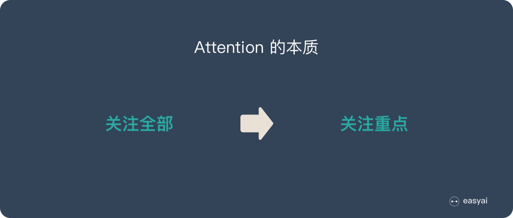
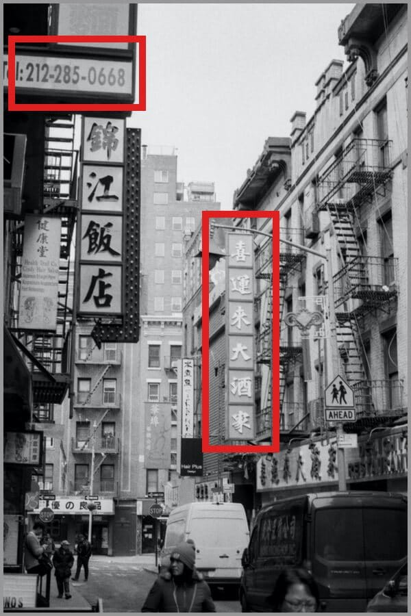
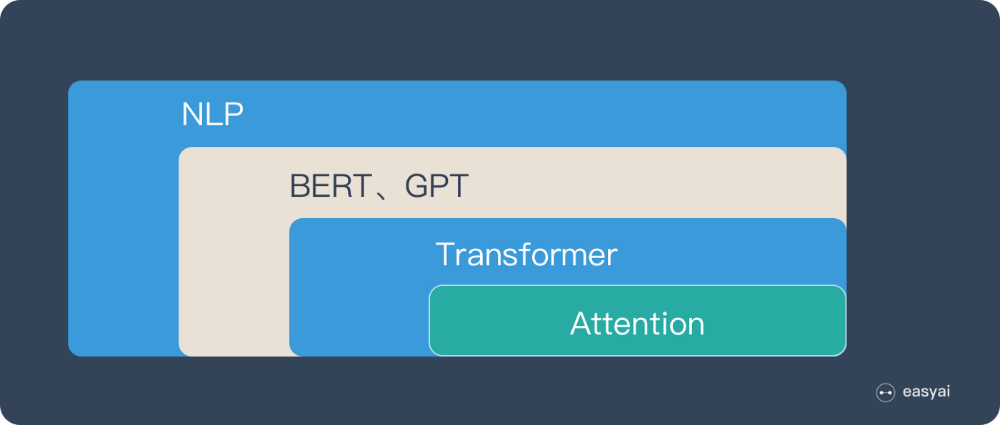
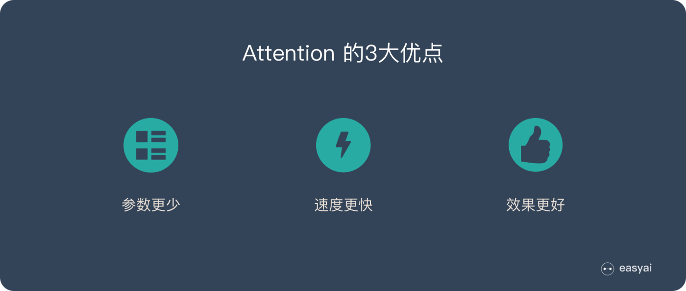
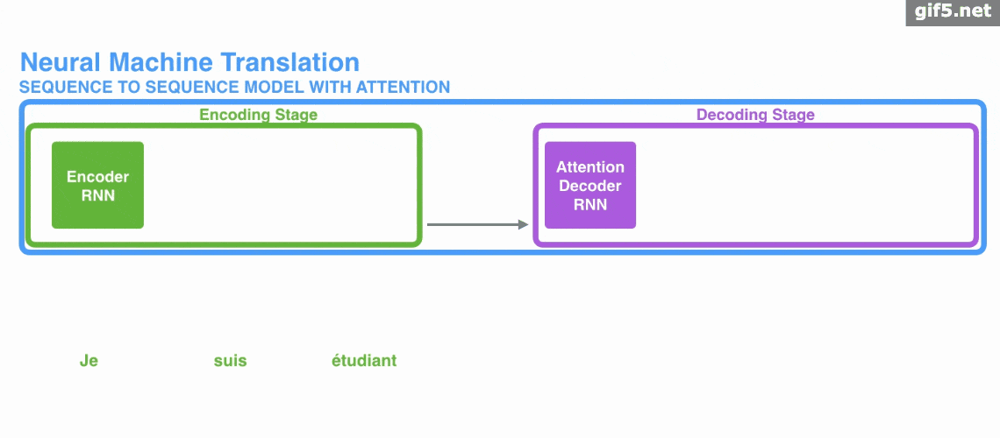
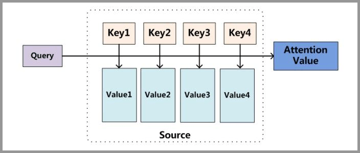
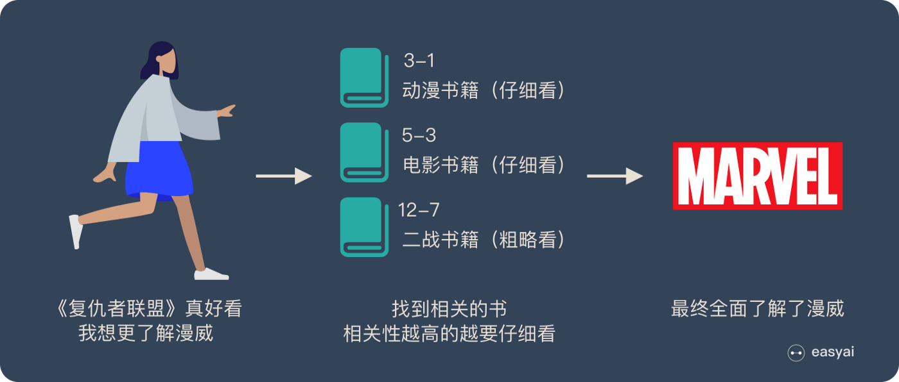
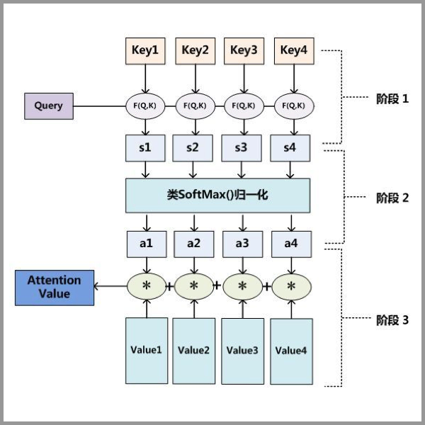
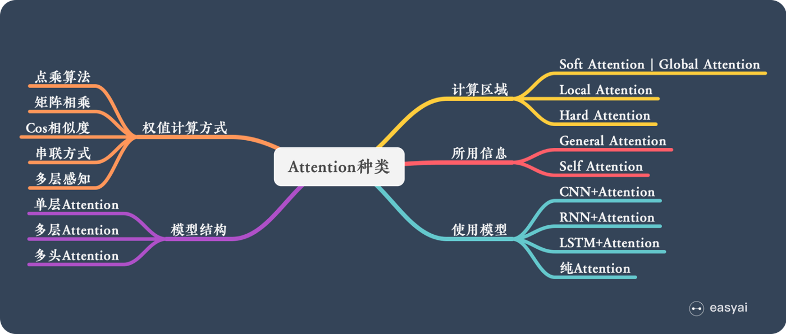

# 一文看懂 Attention
[原文](https://medium.com/@pkqiang49/一文看懂-`Attention`-本质原理-3大优点-5大类型-e4fbe4b6d030)
`Attention`正在被越来越广泛的得到应用。尤其是BERT火爆了之后。

`Attention`到底有什么特别之处？他的原理和本质是什么？`Attention`都有哪些类型？本文将详细讲解`Attention`的方方面面。

## 1. Attention的本质是什么
`Attention`（注意力）机制如果浅层的理解，跟他的名字非常匹配。他的核心逻辑就是`从关注全部到关注重点`。

`Attention`机制很像人类看图片的逻辑，当我们看一张图片的时候，我们并没有看清图片的全部内容，而是将注意力集中在了图片的焦点上。大家看一下下面这张图：

我们一定会看清`锦江饭店`4个字，如下图：

但是我相信没人会意识到`锦江饭店`上面还有一串`电话号码`，也不会意识到`喜运来大酒家`，如下图：

所以，当我们看一张图片的时候，其实是这样的：

上面所说的，我们的视觉系统就是一种**Attention机制**，将有限的注意力集中在重点信息上，从而节省资源，快速获得最有效的信息。

### 1.1 AI领域的Attention机制
`Attention`机制最早是在计算机视觉里应用的，随后在NLP领域也开始应用了，真正发扬光大是在NLP领域，因为2018年BERT和GPT的效果出奇的好，进而走红。而Transformer和`Attention`这些核心开始被大家重点关注。

如果用图来表达`Attention`的位置大致是下面的样子：

这里先让大家对`Attention`有一个宏观的概念，下文会对`Attention`机制做更详细的讲解。在这之前，我们先说说为什么要用`Attention`。

## 2. Attention的3大优点
之所以要引入`Attention`机制，主要是3个原因：
1. 参数少：模型复杂度跟CNN、RNN相比，复杂度更小，参数也更少。所以对算力的要求也就更小
2. 速度快：`Attention`解决了RNN不能并行计算的问题。`Attention`机制每一步计算不依赖于上一步的计算结果，因此可以和CNN一样并行处理
3. 效果好：在`Attention`机制引入之前，有一个问题大家一直很苦恼，即长距离的信息会被弱化，就好像记忆能力弱的人，记不住过去的事情是一样的

`Attention`是挑重点，就算文本比较长，也能从中间抓住重点，不丢失重要的信息。下图红色的预期就是被挑出来的重点。

## 3. Attention的原理
`Attention`经常会和`Encoder–Decoder`一起说，之前的文章[《一文看懂 NLP 里的模型框架 Encoder-Decoder 和 Seq2Seq》](https://easyai.tech/ai-definition/encoder-decoder-seq2seq/) 也提到了`Attention`。

下面的动图演示了`Attention` 引入Encoder-Decoder框架下，完成机器翻译任务的大致流程。

但是，`Attention`并不一定要在Encoder-Decoder框架下使用的，他是可以脱离Encoder-Decoder框架的。
下面的图片则是脱离Encoder-Decoder框架后的原理图解。

### 3.1 小故事讲解
上面的图看起来比较抽象，下面用一个例子来解释`Attention`的原理：

图书管（source）里有很多书（value），为了方便查找，我们给书做了编号（key）。当我们想要了解漫威（query）的时候，我们就可以看看那些动漫、电影、甚至二战（美国队长）相关的书籍。为了提高效率，并不是所有的书都会仔细看，针对漫威来说，动漫，电影相关的会看的仔细一些（权重高），但是二战的就只需要简单扫一下即可（权重低）。

当我们全部看完后就对漫威有一个全面的了解了。

### 3.2 Attention原理的3步分解

1. query和key进行相似度计算，得到权值
2. 将权值进行归一化，得到直接可用的权重
3. 将权重和value进行加权求和

从上面的建模，我们可以大致感受到`Attention`的思路简单，四个字**带权求和**就可以高度概括，大道至简。做个不太恰当的类比，人类学习一门新语言基本经历四个阶段：
1. 死记硬背：通过阅读背诵学习语法练习语感
2. 提纲挈领：简单对话靠听懂句子中的关键词汇准确理解核心意思
3. 融会贯通：复杂对话懂得上下文指代、语言背后的联系，具备了举一反三的学习能力
4. 登峰造极：沉浸地大量练习

这也如同`Attention`的发展脉络，RNN时代是死记硬背的时期，`Attention`的模型学会了提纲挈领，进化到`Transformer`，融汇贯通，具备优秀的表达学习能力，再到`GPT`、`BERT`，通过多任务大规模学习积累实战经验，战斗力爆棚。

要回答为什么`Attention`这么优秀？是因为它让模型开窍了，懂得了提纲挈领，学会了融会贯通。

## 4. Attention的N种类型
`Attention`有很多种不同的类型：
+ Soft Attention
+ Hard Attention
+ 静态Attention
+ 动态Attention
+ Self Attention
+ 等等......

下面就跟大家解释一下这些不同的`Attention`都有哪些差别。

由于这篇文章[《Attention用于NLP的一些小结》](https://zhuanlan.zhihu.com/p/35739040)已经总结的很好的，下面就直接引用了。

本节从计算区域、所用信息、结构层次和模型等方面对`Attention`的形式进行归类。

### 4.1 计算区域
根据`Attention`的计算区域，可以分成以下几种：

##### Soft Attention
这是比较常见的`Attention`方式，对所有key求权重概率，每个key都有一个对应的权重，是一种全局的计算方式（也可以叫**Global Attention**）。这种方式比较理性，参考了所有key的内容，再进行加权。但是计算量可能会比较大一些

##### Hard Attention
这种方式是直接精准定位到某个key，其余key就都不管了，相当于这个key的概率是1，其余key的概率全部是0。因此这种对齐方式要求很高，要求一步到位，如果没有正确对齐，会带来很大的影响。另一方面，因为不可导，一般需要用强化学习的方法进行训练（或者使用`gumbel softmax`之类的）

##### Local Attention
这种方式其实是以上两种方式的一个折中，对一个窗口区域进行计算。先用Hard方式定位到某个地方，以这个点为中心可以得到一个窗口区域，在这个小区域内用Soft方式来算`Attention`

### 4.2 所用信息
假设我们要对一段原文计算`Attention`，这里原文指的是我们要做`Attention`的文本，那么所用信息包括内部信息和外部信息，内部信息指的是原文本身的信息，而外部信息指的是除原文以外的额外信息。

##### General Attention
这种方式利用到了外部信息，常用于需要构建两段文本关系的任务，query一般包含了额外信息，根据外部query对原文进行对齐。
		
比如在阅读理解任务中，需要构建问题和文章的关联，假设现在baseline是，对问题计算出一个问题向量q，把这个q和所有的文章词向量拼接起来，输入到LSTM中进行建模。那么在这个模型中，文章所有词向量共享同一个问题向量，现在我们想让文章每一步的词向量都有一个不同的问题向量，也就是，在每一步使用文章在该步下的词向量对问题来算`Attention`，这里问题属于原文，文章词向量就属于外部信息

##### Local Attention
这种方式只使用内部信息，key和value以及query只和输入原文有关，在`self attention`中，key=value=query。既然没有外部信息，那么在原文中的每个词可以跟该句子中的所有词进行`Attention`计算，相当于寻找原文内部的关系。

还是举阅读理解任务的例子，上面的baseline中提到，对问题计算出一个向量q，那么这里也可以用上`Attention`，只用问题自身的信息去做`Attention`，而不引入文章信息。

### 4.3 结构层次
结构方面根据是否划分层次关系，分为`单层Attention`，`多层Attention`和`多头Attention`：

##### 单层Attention
这是比较普遍的做法，用一个query对一段原文进行一次`Attention`

##### 多层Attention
一般用于文本具有层次关系的模型，假设我们把一个document划分成多个句子，在第一层，我们分别对每个句子使用`Attention`计算出一个句向量（也就是`单层attention`）；在第二层，我们对所有句向量再做`Attention`计算出一个文档向量（也是一个`单层attention`），最后再用这个文档向量去做任务

##### 多头Attention
这是`Attention is All You Need`中提到的`multi-head attention`，用到了多个query对一段原文进行了多次`Attention`，每个query都关注到原文的不同部分，相当于重复做多次`单层Attention`：

$\mathrm{head}_i = \mathit{Attention}(q_i, K, V)$

最后再把这些结果拼接起来：
$\mathit{MultiHead}(Q, K, V) = \mathit{Concat}(\text{head}_1,\dots,\text{head}_g)W^o$

### 4.4 模型方面
从模型上看，`Attention`一般用在CNN和LSTM上，也可以直接进行纯`Attention`计算。

##### CNN+Attention
CNN的卷积操作可以提取重要特征，我觉得这也算是`Attention`的思想，但是CNN的卷积感受视野是局部的，需要通过叠加多层卷积区去扩大视野。另外，`Max Pooling`直接提取数值最大的特征，也像是`hard attention`的思想，直接选中某个特征。

CNN上加`Attention`可以加在这几方面：
1. 在卷积操作前做`Attention`，比如`Attention-Based BCNN-1`，这个任务是文本蕴含任务需要处理两段文本，同时对两段输入的序列向量进行`Attention`，计算出特征向量，再拼接到原始向量中，作为卷积层的输入
2. 在卷积操作后做`Attention`，比如`Attention-Based BCNN-2`，对两段文本的卷积层的输出做`Attention`，作为pooling层的输入
3. 在pooling层做`Attention`，代替`max pooling`。比如`Attention pooling`，首先我们用LSTM学到一个比较好的句向量，作为query，然后用CNN先学习到一个特征矩阵作为key，再用query对key产生权重，进行attention，得到最后的句向量

##### LSTM+Attention
LSTM内部有Gate机制，其中`input gate`选择哪些当前信息进行输入，`forget gate`选择遗忘哪些过去信息，我觉得这算是一定程度的`Attention`了，而且号称可以解决长期依赖问题，实际上LSTM需要一步一步去捕捉序列信息，在长文本上的表现是会随着step增加而慢慢衰减，难以保留全部的有用信息。

LSTM通常需要得到一个向量，再去做任务，常用方式有：
1. 直接使用最后的hidden state（可能会损失一定的前文信息，难以表达全文）
2. 对所有step下的hidden state进行等权平均（对所有step一视同仁）
3. `Attention`机制，对所有step的hidden state进行加权，把注意力集中到整段文本中比较重要的hidden state信息。性能比前面两种要好一点，而方便可视化观察哪些step是重要的，但是要小心过拟合，而且也增加了计算量

##### 纯Attention
`Attention is all you need`，没有用到CNN/RNN，乍一听也是一股清流了，但是仔细一看，本质上还是一堆向量去计算`Attention`。

### 4.5 相似度计算方式
在做`Attention`的时候，我们需要计算query和某个key的分数（相似度），常用方法有：

##### 点乘
最简单的方法，$s(q, k) = q^{\top}k$

##### 矩阵相乘
$s(q, k) = q^{\top}Wk$

##### cos相似度
$s(q, k) = \displaystyle\frac{q^{\top}k}{\lVert q \rVert \cdot \lVert k \rVert}$

##### 串联方式
把q和k拼接起来，$s(q, k) = W[q;k]$

##### 用多层感知机
$s(q, k) = v_{a}^{\top}\mathcal{tanh}(Wq+Uk)$

## 5. 参考
[Attention用于NLP的一些小结](https://zhuanlan.zhihu.com/p/35739040)
[深度学习中的注意力机制](https://blog.csdn.net/tg229dvt5i93mxaq5a6u/article/details/78422216)
[遍地开花的Attention，你真的懂吗？](https://zhuanlan.zhihu.com/p/77307258)
[探索NLP中的Attention 注意力机制及Transformer详解](https://www.infoq.cn/article/lteUOi30R4uEyy740Ht2)