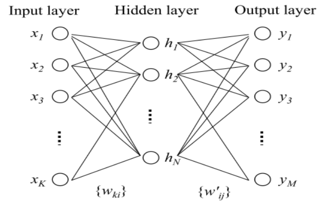
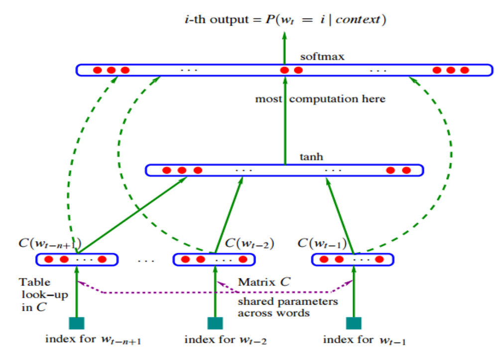
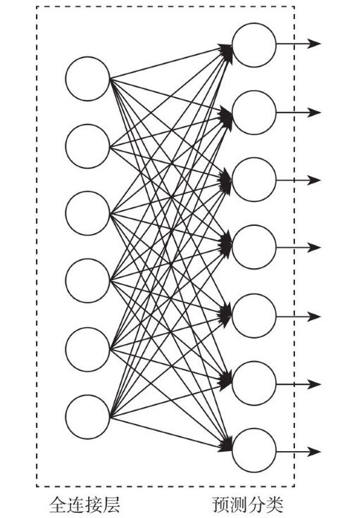
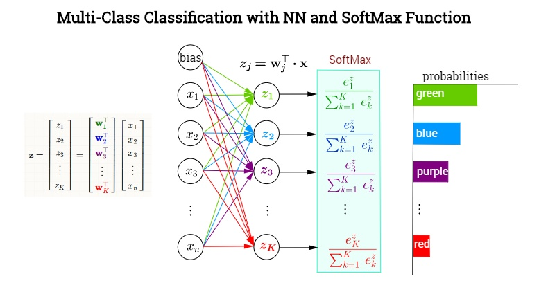
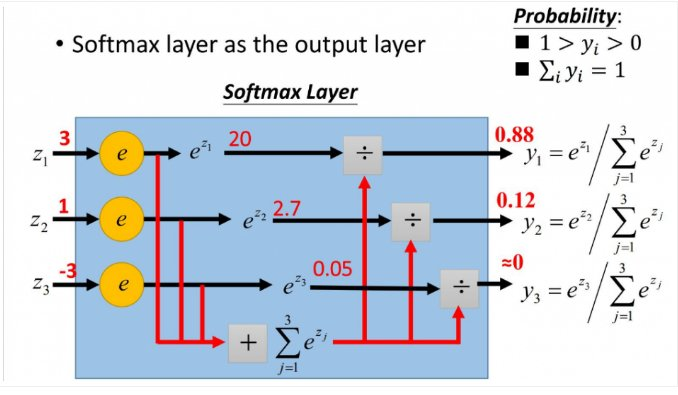
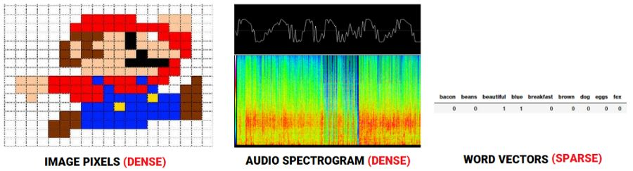
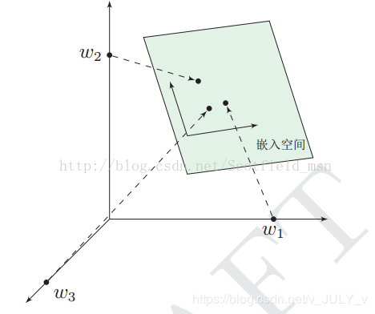
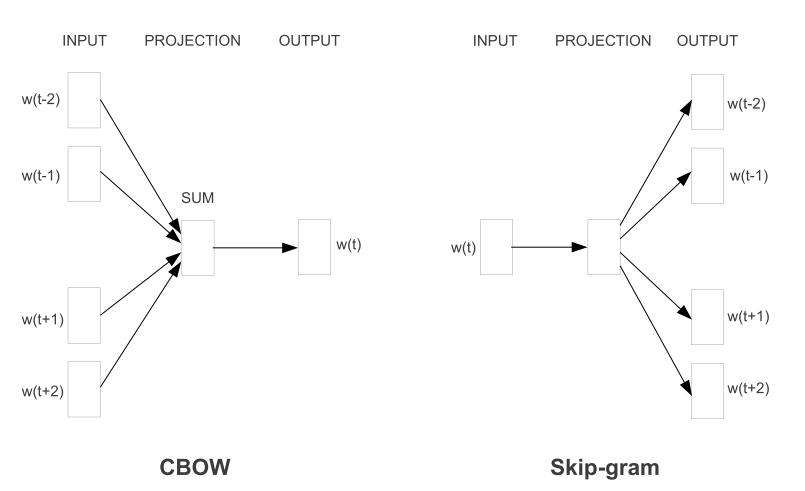
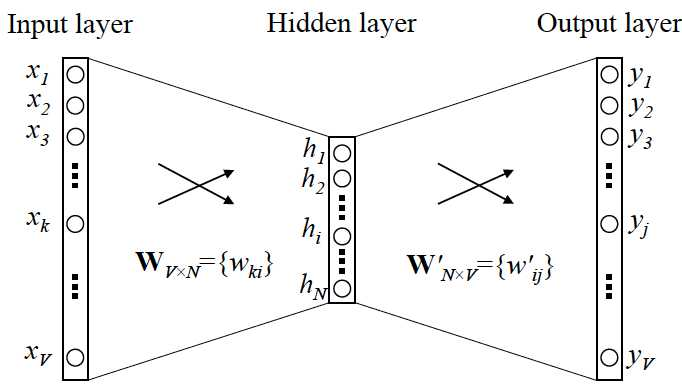

`word2vec`则是`word embedding`的一种模型，也是目前使用最广的词向量模型, 由Google的`Mikolov`团队2013年提出。之前仅仅能够使用第三方库来训练直接使用，对其中原理并没有多少理解，本文比较完整的从背景知识到原理、参数训练等方面讲解`word2vec`。

> `Mikolov`的两篇文章中涉及`word2vec`的细节甚少， 有不少人都对此模型作出了更加详细的解释，本文主要沿着`Rong, X.word2vec Parameter Learning Explained`这篇文章的思路来整理一下，很多公式参考于这篇文章。
> 
> 参考
> + Mikolov, T.(2013). Distributed Representations of Words and Phrases and their Compositionality
> + Mikolov, T.(2013). Efficient Estimation of Word Representations in Vector Space
> Rong, X. (2014). word2vec Parameter Learning Explained

# 1. 神经网络与语言模型
## 1.1 神经网络
引入`word2vec`之前需要先对神经网络的知识有一定了解,。

下图这个是一个简单的三层神经网络，$x=[x_1,x_2,...x_K]$是模型的输入，中间经过与权重矩阵运算，矩阵运算结果再经过非线性激活函数得到隐藏层的结果$h$，从隐藏层到输出层同理。

这样从输入层到输出层既有线性变换，又有非线性变换，因此可以更好刻画出输入变量的特征。

> 值得一提的是，有的神经网络表示中会存在没有隐藏层，只有：输入层、投影层、输出层这三层的神经网络。为何要提到这点呢？下文你会看到，word2vec中就存在输入层、投影层、输出层三层的表示，没有隐藏层。

## 1.2 语言模型
作为`Word Embedding`的背景，语言模型(Language Model)也是很有必要简要介绍一下。

语言模型有统计语言模型，也有神经语言模型。

### 1.2.1 统计语言模型：N-gram模型
什么是所谓的**统计语言模型**(Language Model)呢？简单来说，统计语言模型就是用来计算句子概率的概率模型。比如机器翻译中，如何挑选一个概率尽可能大的句子也就是尽量靠谱的句子返回。

计算句子概率的概率模型很多，`N-gram`模型便是其中的一种。

假设一个长度为$t$的句子，包含这些词：$[(w_1,w_2,w_3,\dots,w_t)]$，那么这个句子的概率(也就是这$t$个词共现的概率)是：
+ $\boldsymbol{P}(\text{sen} = (w_1,w_2,\dots,w_t)) = \boldsymbol{P}(w_1)\boldsymbol{P}(w_2|w_1)\boldsymbol{P}(w_3|w_2,w_1)\dots \boldsymbol{P}(w_t|w_{t-1}\dots w_1)$

一般来说，语言模型都是为了使得条件概率：$\boldsymbol{P}(w_t|w_1,w_2,\dots ,w_{t−1})$最大化，不过考虑到近因效应，当前词只与距离它比较近的$n$个词更加相关(一般$n$不超过5)，而非前面所有的词都有关。因此上述公式可以近似为：
+ $\boldsymbol{P}(w_t|w_1,w_2 \dots w_{t-1}) = \boldsymbol{P}(w_t|w_{t-1}w_{t-2}\dots w_{t-(n+1)}$

上述便是经典的`N-gram`模型的表示方式。

不过，`N-gram`模型仍有其局限性。首先，由于参数空间的爆炸式增长，它无法处理更长程的`context(N>3)`。

其次，它没有考虑词与词之间内在的联系性。

> 例如，考虑`the cat is walking in the bedroom`这句话：如果我们在训练语料中看到了很多类似`the dog is walking in the bedroom`或是`the cat is running in the bedroom`这样的句子；那么，哪怕我们此前没有见过这句话`the cat is walking in the bedroom`，也可以从`cat`和`dog`（`walking`和`running`）之间的相似性，推测出这句话的概率。

然而， `N-gram`模型做不到。这是因为`N-gram`本质上是将词当做一个个孤立的原子单元(atomic unit)去处理的。这种处理方式对应到数学上的形式是一个个离散的`one-hot`向量(除了一个词典索引的下标对应的方向上是1，其余方向上都是0)。

例如，对于一个大小为5的词典：`{"I", "love", "nature", "luaguage", "processing"}`，其中的`nature`对应的`one-hot`向量为：$[0,0,1,0,0]$。显然，`one-hot`向量的维度等于词典的大小。

### 1.2.2 神经语言模型：NNLM模型
接下来简单介绍一下什么是**神经语言模型**(NNLM)。`NNLM`最初由`Bengio`在2003年发表的一篇论文`《A Neural Probabilistic Language Mode》`中提出来的，`word2vec`便是从其中简化训练而来。

咱们来考虑一个词表$C$的大小为$V$(相当于总共有$V$个词，词用$w$表示，比如$V$为5000，则词表包含5000个词)，词表里每个词$w$的维度为$m$，即，如果词的输入是`one hot`编码，则$V = m$，另外$n$表示词$w$的上下文中包含的词数，不超过5。

Bengio通过下面的一个三层神经网络来计算$\boldsymbol{P}(w_t|w_{t-1}w_{t-2}\dots w_{t-(n+1)}$：

我们分析一下这个三层神经网络的工作原理：
1. 首先第一层输入就是前$n−1$个词$ w_{t−(n+1)}, ... ,w_{t-2},w_{t−1}$个词；我们用这个$n-1$个词去预测第 $t$个词是$w_t$的概率
2. 这里的矩阵$C \in |V| \times d$维护着词汇表中所有词的词向量，其中$|V|$是词汇表中词的个数，$d$是词向量的维度；我们根据输入的前$n−1$个词，在同一个词汇表$C$中一一找到它们对应的词向量
3. 把所有词向量直接串联起来成为一个维度为$(n−1)*m$的向量$x$作为接下来三层神经网络的输入(注意：这里的`串联`，其实就是$n-1$个向量按顺序首尾拼接起来形成一个长向量)
4. 后面就是普通神经网络了。需要说明的是，因为我们是要预测概率最大的$w_t$，因此最后输出层的神经元应该与词汇表大小同样为$|V|$
5. 隐藏层到输出层之间有大量的矩阵向量计算，在输出层之后还需要做`softmax`归一化计算(使用`softmax`函数归一化输出之后的值是`[0,1]`，代表可能的每个词的概率。至于为什么要用`softmax`，请看[此文](https://www.julyedu.com/question/big/kp_id/26/ques_id/2614)

> 在原文中存在一些直连边，也就是上图中的虚线，从输入层直接到输出层，是一个线性变换。`Bingo`在文中表示，直连边的存在大幅降低迭代次数，但对语言模型效果无提升，随着计算能力的提高，后续的工作基本都去掉了直连边

神经语言模型构建完成之后，就是训练参数了。这里的参数包括词向量矩阵$C$， 以及三层神经网络的权重、偏置等参数。

模型的训练数据就是大堆大堆的语料库。训练结束之后，语言模型得到了：通过$w_{t−(n+1)} ,\dots, w_{t−1}$去预测第$t$个词是$w_t$的概率，但有点意外收获的是词向量$w_{t−(n+1)} ,\dots, w_{t−1}$也得到了。换言之，词向量是这个语言模型的副产品。

当然，这个模型的缺点就是速度问题，因为词汇表往往很大，包含几十万甚至几百万的词，训练起来就很耗时，`Bengo`仅仅训练5个epoch就花了3周，这还是40个CPU并行训练的结果。因此才会有了后续好多的优化工作，`word2vec`便是其中一个。

##### softmax函数
常用于神经网络输出层的激励函数softmax函数长什么样子呢？我们先看一个神经网络的示意图：

从图的样子上看，和普通的全连接方式并无差异，但激励函数的形式却大不一样：

我们看一个具体例子，如下图所示：

首先后面一层作为预测分类的输出节点，每一个节点就代表一个分类，那么图中的这3个节点就代表着3个分类的模型，任何一个节点的激励函数都是：
+ $\displaystyle\sigma_{i}(z) = \frac{e^{z_{i}}}{\displaystyle\sum_{j=1}^{m}e^{z_{i}}}$

其中$i$就是节点的下标次序，而$z_i = w_ix+b_i$，也就说这是一个线性分类器的输出作为自然常数$e$的指数。最有趣的是最后一层有这样的特性：
+ $\displaystyle \sum_{i=1}^{J}\sigma_i(z) = 1$

也就是说最后一层的每个节点的输出值的加和是1。这种激励函数从物理意义上可以解释为一个样本通过网络进行分类的时候在每个节点上输出的值都是小于等于1的，是它从属于这个分类的概率。

# 2. word2vec
**Deep Learning**如何能在NLP中发挥出应有的作用呢？很明显，先不提如何设计出很强势的网络结构，不提如何在NLP中引入基于NN的解决例如情感分析、实体识别、机器翻译、文本生成等这些高级任务，我们先想想如何让语言表示成为NN能够处理的数据类型。

首先看看图像和语音是怎么表示数据的：

在处理语音时，用音频频谱序列向量所构成的矩阵从输入层输入到NN进行处理；在处理图像时，将图片的像素构成的矩阵变换成向量后，组成的批量的序列输入到NN进行处理；那在自然语言处理中呢？我们可以将每一个词用一个向量表示出来！想法是挺简单的，事实上也就是这么简单，但是包含的原理可能没这么简单。

## 2.1 什么是词嵌入
NLP里面，最细粒度的是词语，词语组成句子，句子再组成段落、篇章、文档。所以处理NLP的问题，首先就要拿词语开刀。

居住在地球上各个国家的人们通过各自的语言进行交流，但机器无法直接理解人类的语言，所以需要先把人类的语言`计算机化`。那如何变成计算机可以理解的语言呢？

我们可以从另外一个角度上考虑。举个例子，对于计算机，它是如何判断一个词的词性，是动词还是名词的呢？

我们有一系列样本$(x,y)$，对于计算机技术机器学习而言，这里的$x$是词语，$y$是它们的词性，我们要构建$f(x)\rightarrow y$的映射：
1. 首先，这个数学模型$f$(比如神经网络、SVM)只接受数值型输入
2. 而NLP里的词语，是人类语言的抽象总结，是符号形式的(比如中文、英文、拉丁文等等)；如此一来，我们便需要把NLP里的词语转换成数值形式，或者嵌入到一个数学空间里
3. 我们可以把文本分散嵌入到另一个离散空间，称作**分布式表示**，又称为`词嵌入`(word embedding)或`词向量`
4. 一种简单的词向量是`one-hot encoder`，所谓`one-hot`编码，其思想跟特征工程里处理类别变量的`one-hot`一样，本质上是用一个只含一个1、其他都是0的向量来唯一表示词语

传统的`one-hot`编码仅仅只是将词符号化，不包含任何语义信息。而且词的独热表示(one-hot representation)是高维的，且在高维向量中只有一个维度描述了词的语义。多高？词典有多大就有多少维，一般至少上万的维度。所以我们需要解决两个问题：
1. 需要赋予词语义信息
2. 降低维度

这就轮到`word2vec`出场了。

## 2.2 word2vec登场
`word2vec`是`Google`研究团队里的`Tomas Mikolov`等人于2013年的`《Distributed Representations of Words and Phrases and their Compositionality》`以及后续的`《Efficient Estimation of Word Representations in Vector Space》`两篇文章中提出的一种高效训练词向量的模型，基本出发点是上下文相似的两个词，它们的词向量也应该相似，比如香蕉和梨在句子中可能经常出现在相同的上下文中，因此这两个词的表示向量应该就比较相似。

实际上，大部分的有监督机器学习模型，都可以归结为：$f(x)\rightarrow y$。

在有些NLP问题中，把$x$看做一个句子里的一个词语，$y$是这个词语的上下文词语，那么这里的$f$便是上文中所谓的`语言模型`(language model)，这个语言模型的目的就是判断$(x,y)$这个样本是否符合自然语言的法则，更通俗点说就是：有了语言模型之后，我们便可以判断出，词语$x$和词语$y$放在一起，是不是符合人类语言的标准。

在训练过程中，这个语言模型还得到了一个副产品：`词向量矩阵`。对于`word2vec`而言，词向量矩阵的意义就不一样了，因为`word2vec`的最终目的不是为了得到一个语言模型，也不是要把$f$训练得多么完美，而是只关心模型训练完后的副产物：`词向量矩阵`。

我们来看个例子，如何用`word2vec`寻找相似词：
1. 对于一句话：`她们 夸 吴彦祖 帅 到 没朋友`，如果输入$x$是`吴彦祖`，那么$y$可以是：“她们、夸、帅、没朋友”这些词
2. 现有另一句话：`她们 夸 我 帅 到 没朋友`，如果输入$x$是`我`，那么不难发现，这里的上下文$y$跟上面一句话一样
3. 从而$f(\text{吴彦祖}) = f(\text{我}) = y$，所以语言模型告诉我们：`我 = 吴彦祖`

## 2.3 word2vec模式下的两个模型：CBOW和SkipGram
`word2vec`模型中比较重要的概念是词汇的上下文，说白了就是一个词周围的词，比如$w_t$的范围为1的上下文就是$w_{t−1}$和$w_{t+1}$。在`word2vec`中提出了两个模型(假设上下文窗口为3)：
+ **CBOW**(Continuous Bag-of-Word)：以上下文词汇预测当前词，即用$w_{t-2}、w_{t-1}、w_{t+1}、w_{t+2}$去预测$w_t$ 
+ **SkipGram**：以当前词预测其上下文词汇，即用$w_t$去预测$w_{t-2}、w_{t-1}、w_{t+1}、w_{t+2}$

两个模型图示如下：

*图来自2013年Mikolov的原始论文，注意这里没有隐藏层，只有输入层、投影层、输出层，且输入层到投影层不带权重，投影层到输出层带权重*

下面将会从最简单的上下文只有一个词的情形入手，然后扩展到`CBOW`以及`Skip-gram`，介绍原理以及参数训练过程。关于`word2vec`的训练这里将会从完全的BP神经网络的过程来介绍。

## 2.4 One-Word Model
我们先来看个最简单的例子，输入输出都只有一个词。上面说到，$y$是$x$的上下文，所以$y$只取上下文里一个词语的时候，语言模型就变成：**用当前词$x$预测它的下一个词$y$**。

其中，
+ $V$：词汇表长度
+ $N$：隐藏层神经元个数，同时也是词向量维度
+ $W \in R^{V\times N}$：输入层到隐藏层的权重矩阵，其实就是词向量矩阵，其中每一行代表一个词的词向量
+ $W' \in R^{N\times V}$：隐藏层到输出层的权重矩阵，其中每一列也可以看作额外的一种词向量

> 看到这，你可能开始纳闷了，怎么前一个图是输入层、投影层、输出层，且输入层到投影层不带权重，投影层到输出层带权重，而这个图是输入层、隐藏层、输出层，且输入层到隐藏层以及隐藏层到输出层都带权重呢？
> 
> 仔细深究，你会发现上一个图来自2013年`Mikolov`的原始论文，这一个图来自2014年`Rong, X`的文章，虽然都是讲的`word2Vec`，但这两者之间有不少微妙的差别，但是本质是一样的：
> + 2013年，`Mikolov`发表`word2vec`的原始论文，`word2vec`的网络结构里没有隐藏层，只有输入层、投影层、输出层，且输入层到投影层不带权重，因为只是对输入层做累加求和，学习迭代的是原始输入，而投影层到输出层虽然一开始带了权重，但在实际训练的时候，因为投影层到输出层的计算量巨大，所以改了投影层到输出层的网络结构，去掉了权重，且训练用的方法是HS或负采样。
> + 2014年`Rong, X`在以`word2vec是一个深度学习模型`这个概念的影响下，`word2vec`的网络结构里涉及神经网络中经典的输入层、隐藏层、输出层，通过从输入层到隐藏层或隐藏层到输出层的权重矩阵去向量化表示词的输入，学习迭代的是两个权重矩阵(分别用$W、W'$表示)，当然，从输入层到隐藏层的权重矩阵$W$的计算量还好(因为隐藏层的激活函数其实是线性的，相当于没做任何处理，我们要训练这个神经网络，可以用反向传播算法，本质上是链式求导梯度下降那一套。关于如何理解反向传播，请点击[此文](https://www.julyedu.com/question/big/kp_id/26/ques_id/2921)），但从隐藏层到输出层的权重矩阵$W'$的计算量巨大，所以和2013年Mikolov的工作一样，也是去掉了权重$W'$，且训练用的方法也是HS或负采样。

下面从神经网络的前向过程开始介绍:

我们需要做的是用输入的词去预测输出的词。其中输入层的单词$w_I$使用`one-hot`来表示的，即在上图中$x_1, x_2, x_3,\dots,x_V$，其中只有$x_k$为1，其余为0，$k$可以是输入的词在词汇表中的索引下标。之后就是经过词向量矩阵$\boldsymbol{W}$连接输入层和隐藏层，其中由于$X$中只有一个1，因此经过与$\boldsymbol{W}$相乘, 相当于取出$\boldsymbol{W}$中的的第$k$行，实际也就是输入单词的$w_I$的$N$维的词向量，$v_{w_I}$表示，来作为隐藏层的值，注意`word2vec`的隐藏层并没有激活函数:
+ $\mathbf{h} = W^T \cdot X = v_{w_I}^T$

然后考虑从隐藏层的$\mathbf{h}$到输出层$Y$，同样$\mathbf{h}$经过矩阵$W'$相乘，得到一个$V \times 1$的向量$\mathbf{u}$：
+ $\mathbf{u} = W^{'T} \cdot h$

其中$\mathbf{u}$每个元素$\mathbf{u}_j$就是$W'$的第$j$列用$v^{'}_{w_j}$表示，与$h$做内积得到: 
+ $u_j = v_{w_j}^{'T}\cdot h$

含义就是词汇表中第$j$个词的分数，我们的目的就是要根据输入词$w_I$去预测输出的词，因此预测的词就取分数最高的即可，这里为了方便概率表示，使用`softmax`将$\mathbf{u}$归一化到`[0,1]`之间，从而作为输出词的概率，其实是一个多项分布, 也就是上图中的$y$：
+ $P(w_j|w_I) = y_j = \displaystyle\frac{\exp(u_j)}{\sum\limits_{k\in V} \exp(u_k)} =   \displaystyle\frac{\exp(v_{w_j}^{'T}\cdot v_{w_I})}{\sum\limits_{k\in V} \exp(v_{w_k}^{'T}\cdot v_{w_I})}$

其中$v_w$与$v^{'}_w$都称为词$w$的词向量，一般使用前者作为词向量，而非后者，原因后续会解释。至此前向过程完成，就是给定一个词作为输入，来预测它的上下文词，还是比较简单的，属于简化版的神经语言模型。这个过程中需要用到的参数有两个词向量矩阵$W,W'$，下面就是重点了，介绍如何根据语料库来训练模型、更新参数，得到最终的词向量。

上面的算法可以用下图表示：

##### 输出层到隐藏层权重更新
首先明确训练数据的格式，对于一个训练样本$w_I, w_O$，输入是词$w_i$的`one-hot`的维度为$V$的向量$x$，模型预测的输出同样也是一个维度为$V$的向量$y$，同时真实值$w_O$也是用`one-hot`表示，记为$\mathbf{t}=[0,0,0,\dots,1,0,0]$，其中假设$t_{j^{*}} = 1$，也就是说$t_{j^{*}}$是真实单词在词汇表中的下标，那么根据最大似然或者上面的语言模型，目标函数可以定义如下：

$$\begin{align*} O &= \max P(w_O|w_I) \\ & = \max y_{j^{*}} :=  \max \log y_{j^{*}} \\ &= \max \log(\displaystyle\frac{\exp(u_{j^{*}})}{\sum  \exp(u_k)}) = \max u_{j^{*}}-\log\sum_{k=1}^{V}\exp( u_k) \end{align*}$$

一般我们习惯于最小化损失函数，因此定义损失函数：
$\displaystyle E = -u_{j^{*}}+\log\sum_{k=1}^{V}\exp( u_k)$

然后结合反向传播一层层求梯度，使用梯度下降来更新参数。

先求隐藏层到输出层的向量矩阵$W'$的梯度，利用链式法则得到：
+ $\displaystyle\frac{\partial E}{ \partial w{'}_{ij}} = \frac{\partial E}{\partial u_j} \frac{\partial u_j}{\partial w^{'}_{ij}} = (y_j-t_j) h_i$

这里面的$y_j$和$t_j$分别是预测和真实值的第$j$项，$h_i$是隐藏层的第$i$项。推导过程如下：首先推导$\displaystyle\frac{\partial E}{\partial u_j} = y_j - t_j$。我们直接对原始的公式求导，先考虑$E$的对数部分：
+ $\displaystyle\frac{\partial \log \sum\exp(u_k)}{\partial u_j} = \frac{\exp(u_j)}{\sum \exp(u_k)} = y_j$

这里应用了导数公式$\displaystyle\frac{\partial \log{x}}{\partial x} = \frac{1}{x}$、以及$\displaystyle\frac{\partial e^x}{\partial x} = e^x$。

> 如果不明白$\displaystyle\frac{\partial \sum exp(u_k)}{\partial u_j} = exp(u_j)$，可以尝试把式子写成下面的形式：
>
> + $\displaystyle\frac{\partial \sum exp(u_k)}{\partial u_j} = \frac{\partial((exp(u_1)+exp(u_2)+\dots + exp(u_j) + \dots + exp(u_k))}{\partial u_j}= exp(u_j)$

再看$-u_{j^{*}}$对$u_j$的梯度：当$j = j^{*}$时，$\frac{\partial -u_{j^{*}}}{\partial u_j}=-1 = -t_j$，反之，当两者不等时，$\frac{\partial -u_{j^{*}}}{\partial u_j}=0= -t_j$。

所以综合求导得到$\displaystyle\frac{\partial E}{\partial u_j} = y_j - t_j$，这个减法可以理解为输出层的第$j$项为预测值与真实值的差。

接下来对链式公式的第二项$\displaystyle\frac{\partial u_j}{\partial w^{'}_{ij}}$求导。之前推导前项公式时我们得出：
+ $u_j = v_{w_j}^{'T} \cdot h$

带入求导，得到的导数为隐藏层的第$i$项：
+ $\displaystyle\frac{\partial u_j}{\partial w^{'}_{ij}} = h_i$

求导出隐藏层导输出层的梯度之后，也就得到了梯度下降更新公式：

+ $w^{'}_{ij} = {w^{'}_{ij}}^{(old)} -\eta (y_j - t_j) h_i$

整合为$W'$的列向量$\mathbf{v^{'}}_{w_j} = \{w^{'}_{ij}| i=1,2,3,...,N\}$的形式如下：
+ $\mathbf{v}^{'}_{w_j} = {\mathbf{v}^{'}_{w_j}}^{(old)} - \eta(y_j-t_j)\mathbf{h},  \ j \in \{ 1,2,3,...,V\}$

也就是说对每个训练样本都需要做一次复杂度为$V$的操作去更新$W'$。

##### 隐藏层到输入层权重更新
接着考虑隐藏层$h$的更新，其实也是输入层到隐藏层的矩阵$W$的更新。继续反向传播，跟神经网络的相同，输出层的$V$个神经元都会影响$h_i$：
+ $\displaystyle \frac{\partial E}{\partial h_i} = \sum_{j=1}^{V}\frac{\partial E}{\partial u_j}  \frac{\partial u_j}{\partial h_i} = \sum_{j=1}^{V} (y_j-t_j)w^{'}_{ij} =W^{'}_{i} \cdot P$

其中$W^{'}_i$是$W^{'}$的第$i$行, 这里为了方便书写, 令$P = \{ y_j - t_j | j= 1,2,3,..,V\}$，因此整合成整个隐藏层的向量$\mathbf{h}$：
+ $\displaystyle \frac{\partial E}{\partial \mathbf{h}} =  W^{'} \cdot P$

得到一个$N$维的向量，上面已经介绍过，$\mathbf{h}$就是词向量矩阵$W$的一行: $\mathbf{h} = W^T \cdot X = v_{w_I}^T$，但是因为$X$中只有一个1，因此每次只能更新$X$的一行$v_{w_I}$，其余行的梯度为0，所以，$v_{w_I}$的更新公式为:
+ $v_{w_I}^T = v_{w_I}^T - \eta  W^{'} \cdot P$

到此为止，一个训练样本的反向传播训练过程就结束了。 我们可以看到，对于输入层到隐藏层的矩阵$W$，我们每次训练只需要更新一行向量即可，而对于隐藏层到输出层的矩阵$W'$的所有$N \times V$个元素都需要更新一遍，这里的计算量还是很大的。

> 回顾上节内容，我们提到2014年`Rong, X`的论文，文中指出学习迭代的是两个权重矩阵(分别用$W、W'$表示)，学习$W$还好，但学习$W'$的计算量巨大，所以改用的HS或负采样。从上面公式的推导可以看出为什么学习$W'$的计算量巨大

这一节主要比较细致的介绍了最简单的输入输出只有一个单词的情况的推理和训练的过程，后面的`CBOW`(上下文预测单词)以及`SG`(单词预测上下文)均基于这一节扩展开来。

## 2.5 CBOW Model
这一部分讲`word2vec`的第一个形式：`Continurous Bag-Of-Word`，模型图示如下：

跟上一个模型唯一的不同就是输入不再是一个词$w_I$，而是多个词。在上图中一共有$C$个单词：$x_{1k},x_{2k},\dots,x_{Ck}$，每个$x$都是`one-hot`表示。 这样隐藏层的$\mathbf{h}$的计算就会不同了：之前一个单词的模型是直接取出$W$的一行$v_{w_I}$作为$h$的值，在`CBOW`中则是取出$W$中输入的所有$C$个单词的词向量，然后直接取平均，如下：
$\begin{align*} \mathbf{h} &= \frac{1}{C} W^T(x_{1} +x_2+...+x_{C}) \\ &= \frac{1}{C}(v_{w_1} + v_{w_2}+...+v_{w_C})^T\end{align*}$

后面隐藏层到输出层的过程与`One-Word Model`一模一样，包括目标函数定义，反向传播训练等。将$W'$的更新公式照抄下来如下，依旧是每次都需要更新所有的行：
$\mathbf{v}^{'}_{w_j} = {\mathbf{v}^{'}_{w_j}}^{(old)} - \eta(y_j-t_j)\mathbf{h},  \ j \in \{ 1,2,3,...,V\}$

隐藏层神经元的梯度也相同：
$\displaystyle\frac{\partial E}{\partial \mathbf{h}} =  W^{'} \cdot P$

下面考虑输入层到隐藏层稍微有些不同，在`One-Word Model`里面因为输入只有一个词，因此每次训练只更新这个词对应到$W$的那一行，但是在`CBOW`里面有多个词，这里采取的策略是将$h$的梯度均摊到每个词上，因此每次训练会更新$W$中的$C$行，如下：
$\displaystyle v_{w_{I,c}}^T = v_{w_{I,c}}^T - \frac{1}{C}\ \eta  W^{'} \cdot P,\ \ c=1,2,...,C$

到此为止`CBOW`的推理和训练过程也介绍完毕，基本跟`One-Word Model`一样。

## 2.6 SkipGram Model
现在开始介绍`word2vec`的第二种形式：`SkipGram`(根据单词预测上下文)，这个模型与`One-Word Model`不同的地方在于，`SG`的输出有多个词，而非`One-Word`中输出只有一个词，这样输出层就不是一个多项分布了，而是$C$个多项分布了，模型图示如下：

因此从输入层到隐藏层部分与`One-Word Model`相同，隐藏层神经元的计算方式如下：
$\mathbf{h} = W^T \cdot X = v_{w_I}^T$

因为输出层是有$C$个单词， 所以输出有$C$个多项分布$y_{1}, y_{2},\dots,y_{C}$，因此前向计算的过程也需要分开计算，如下公式，用来计算第$c$个输出单词的预测的多项分布中第$j$项，相比`One-Word Model` 多了一个$c$参数：
$\displaystyle P(w_{c,j}|w_I) = y_{c,j} = \frac{\exp (u_{c,j})}{\displaystyle\sum_{k=1}^{V} \exp(u_{c,k})}$

需要注意的是这$C$个输出向量是相互独立的，可以当做是独立的$C$个`One-Word Model`中的输出向量，相互之间没有影响，并且从图中也可以看出，连接隐藏层与$C$个输出层的参数矩阵$W'$是共享的，于是便有：
$u_{c,j} = u_{j} ={v^{'}_{w_j}}^T \cdot \mathbf{h}$

这里的$v^{'}_{w_j}$的含义与`One Word Model`中相同，都代表$W'$的第$j$列，同时也是词汇表中第$j$个单词的一种词向量(虽然实际中不用)。

从前向后根据上述公式计算出$C$个输出向量之后，在每个$V$维向量中选取概率最大的作为输出的单词，这样根据输出单词$w_I$就得到了$C$个输出单词，也就达到了根据单词预测上下文的目的。

下面开始介绍`SG`的反向传播训练的过程，这个跟前面的有些许的不同，首先是损失函数：
$\begin{align*} E &= -\log P(w_{1},w_{2},...,w_{C}| w_I) \\ &= -\log \Pi_{c=1}^{C}P(w_c|w_i) \\ &=-\log \Pi_{c=1}^{C} \frac{\exp (u_{c,j})}{\sum_{k=1}^{V} \exp(u_{c,k})} \\ &= -\sum_{c=1}^{C}u_{j_c^{*}} + C \cdot \log \sum_{k=1}^{V} \exp(u_{k}) \end{align*}$

前面说过输出的$C$个词是相互独立，因此$P(w_1,w_2,...,w_C|W_I) = \Pi P(w_c|w_I)$，此外$j_c^{*}$的含义同`One-Word Model`中的$u_j^{∗}$一样，都代表训练的真实的输出单词在词汇表的下标。下面开始从后向前求梯度，对第$c$个词对应的多项分布的第$j$项的梯度：
$\displaystyle \frac{\partial E}{\partial u_{c,j}} = y_{c,j} - t_{c,j}$

然后考虑$W'$的梯度，考虑到$C$个多项分布产生影响，因此需要求和：
$\displaystyle \frac{\partial E}{\partial w^{'}_{ij}}= \sum_{c=1}^{C}\frac{\partial E}{\partial u_{c,j}}  \frac{\partial u_{c,j}}{\partial w_{ij}^{'}} =\sum_{c=1}^{C}(y_{c,j}-t_{c,j})\mathbf{h_{i}} = Q_j \mathbf{h_i}$

跟`CBOW`一样，为了方便书写定义，令$Q_j = \sum_{c=1}^{C}(y_{c,j} - t_{c,j}), \ j = 1,2,3,\dots,V$，矩阵$Q$的维度是$V1$有了梯度，就可以利用梯度下降更新$w_{ij}^{'}$：
$w_{i,j}^{'}={w_{ij}^{'}}^{(old)} - \eta Q_j\mathbf{h}_i$

或者写成词向量的形式，其实就是$W'$的一列：
$v_{w_j}^{'} = {v_{w_j}^{'}}^{(old)} - \eta Q_j \mathbf{h}, \ j = 1,2,3,\dots,V$

接着考虑对隐藏层神经元的梯度：
$\begin{align*}\frac{\partial E}{\partial \mathbf{h}_i} &=\sum_{c=1}^{C}\sum_{j=1}^{V} \frac{\partial E}{\partial u_{c,j}} \frac{\partial u_{c,j}}{\partial \mathbf{h}_i} \\&=\sum_{c=1}^{C}\sum_{j=1}^{V}(y_{c,j}-t_{c,j}) w^{'}_{ij} \\ &= \sum_{j=1}^{V}Q_jw^{'}_{i,j}=W^{'}_{i} \cdot Q \end{align*}$

因此跟`One-Word Model`一样整合成向量的形式：
$\displaystyle\frac{\partial E}{\partial \mathbf{h}} = W^{'} \cdot Q$

考虑到输入只有一个词，因此跟`One-Word Model`一样：
$\mathbf{h} = {v_{w_I}}^T$

每次训练更新词向量矩阵$W$的一行：
$v_{w_I}^T = v_{w_I}^T - \eta  W^{'} \cdot Q$

到此`SkipGram`模型的前向推理与后向参数的训练也介绍完毕了。

# 3. 优化

## 3.1 复杂度
`CBOW`和`SG`模型是标准的`word2vec`模型，或者说是神经语言模型的简化版，除了去掉了隐藏层的激活函数之外，其余的变化不大，因此训练效率还是很低的。本节我们分析下模型的训练复杂度。

首先明确需要学习的两个词向量矩阵$W, W'$，从前面的推导中知道对于每一个训练样本，`CBOW`更新$W$的$C$行，`SG`更新$W$其中一行，也就是每次更新有限个词的词向量。但是对于$W'$则不同了，正如前面一直提到的，无论是`CBOW`还是`SG`，对每个训练样本(或者Mini Batch)从梯度更新中需要对$W'$的所有$V \times N$个元素，也就是词汇表中所有$V$个单词都需要更新词向量，考虑现实任务词汇表一般是几十万、上百万甚至千万级别的， 这个计算成本是巨大的。

关于计算成本大的原因，除了上面提到的训练部分，还有就是在每次前向计算的时候，隐藏层到输出层的`softmax`函数计算输出层$V$个元素，计算量也是很大，这样整个模型现实意义不大。

考虑到计算量大的部分都是在隐藏层到输出层上，尤其是$W'$的更新。因此`word2vec`使用了两种优化策略: 
+ Hierarchical Softmax 
+ Negative Sampling

这两个策略的出发点是一致的，就是在每个训练样本中，不再完全计算或者更新$W'$这个矩阵。二者都不再显示使用$W'$这个矩阵。因此这也就解释了前面说的为什么不用$W'$作为最终词向量。

在多一句，其实上述训练和推理的复杂度很大的根本原因是softmax的分母上的$\sum$，因此在求梯度的时候，就会有$V$次的计算。因此下面的两种方法其实是对`softmax`的优化，不仅仅限制在`word2vec`。

两种优化方式使得`word2vec`的训练速度大大提升，并且词向量的质量几乎没有下降，这也是`word2vec`在NLP领域如此流行的原因。 

下面的章节将依次介绍这两种优化算法。

## 3.2 Hierarchical SoftMax
首先`Hierarchical SoftMax`(HS)并不是`word2vec`提出来的，而是之前`Bengio`在2005年最早提出来的、专门为了加速计算神经语言模型中的`softmax`的一种方式，这里将介绍如何在`word2vec`中使用`HS`。

`HS`主要是基于哈夫曼树(一种二叉数)将计算量大的部分变为了一种二分类的问题。先看下面的图，原来的模型在隐藏层之后通过$W'$连接输出层，现在`HS`则去掉了$W'$，隐藏层$h$直接与下面的二叉树的`root`节点相连：

其中图中白色的叶子节点表示词汇表中所有的$|V|$个词，黑色节点表示非叶子节点，每一个叶子节点也就是每一个单词，都对应唯一的一条从`root`节点出发的路径，而我们的目的是使$w=w_O$这条路径的概率最大，即：$\boldsymbol{P}(w=w_O | w_I)$最大。此时，每一个分支都代表一个选择，向左转还是向右转。

那么该如何判断向左还是向右呢？我们用$n(w,j)$表示从`root`到叶子节点$w$的路径上的第$j$个非叶子节点，并且每个非叶子节点都对应一个向量$v^{'}_{n(w, j)}$，维度与$\mathbf{h}$相同，然后使用`sigmod`函数：$\displaystyle\sigma(x)= \frac{1}{1+\exp(-x)} \in [0, 1]$，结合向量的内积来判断该向左还是向右。例如，第$n$个节点向左以及向右的概率定义：
$\boldsymbol{P}(n, left ) = \sigma({v^{'}_{w}} \cdot \mathbf{h})$
$\boldsymbol{P}(n, right) =1-\sigma(v^{'}_w \cdot \mathbf{h}) = \sigma(-v_{w}^{'} \cdot h) $

有了上述的概率, 我们可以重新定义$\boldsymbol{P}(w=w_O | w_I)$了：
$\boldsymbol{P}\big(w=w_O|w_I\big) = \Pi_{j=1}^{L(w)-1}\boldsymbol{P}\bigg(\sigma \Big(I\big(n(w,j+1==left)  v^{'}_{w} \cdot \mathbf{h}\big)\Big)\bigg)$

其中$I()$是指示函数，条件成立值为1，反之为-1；而$L(w)$表示整条路径的长度，这样整个概率就是从`root`节点到叶子节点这条路径的概率，这样我们在训练的时候，通过训练样本来更新非叶子节点的参数$v{'}_{w}$。

举个例子，比如上图中的加粗的黑色路径：$\big(n(w_2,1), n(w_2, 2), n(w_2, 3), w_2\big )$，就是说假设有一个训练样本是$(w_I, w_2)$，我们需要使得$\boldsymbol{P}(w_O = w_2|w_I)$概率最大：

$\begin{align*}\boldsymbol{P}(w_2=w_O) &= \boldsymbol{P}(n(w_2,1), left)  \cdot \boldsymbol{P}(n(w_2,2), left) \cdot \boldsymbol{P}(n(w_2, 3), right) \\ &= \sigma({v^{'}_{n(w_2,1)}}^T \mathbf{h}) \cdot \sigma({v^{'}_{n(w_2,2)}}^T \mathbf{h}) \cdot \sigma(-{v^{'}_{n(w_2,3)}}^T \mathbf{h}) \end{align*}$

并且在一个非叶子节点处，向左向右的概率和为1，因此一直分裂下去，最后的和肯定还是1。因此可以很容易得到：
$\displaystyle\sum\limits_{j=1}^{V}P(w_j=w_O) =1$

这一点的证明是有必要的，因为在原始的`softmax`本身保证了所有单词的概率和是1，而通过上式也知道了通过`HS`得到的输出层仍然是一个概率多项分布，输出所有的单词概率和为1。

讲完了从前向后的如何得到输出单词的概率的过程，下面开始后向传播的训练过程。首先需要明确的是训练的参数：输入层与隐藏层的词向量矩阵$W$，以及二叉树的非叶子节点对应的向量$\{v{'}_{n(w,j)}, j =1,2,3,..,L(w)-1\}$。

为了书写方便,下面简化一部分的符号: 用$[I]$表示前面的指示函数$I(n(w,j+1)==left)$，使用$v^{'}_{j}$表示$v^{'}_{n(w,j)}$。

对于一组训练数据，损失函数的定义与前面相同，最大似然(注意这里以`One-Word Model`为例，`CBOW`与`Skip-Gram`按照上述的思路完全一样)：
$E = -\log P(w=w_O|w_I) = - \sum\limits_{j=1}^{L(w)-1}\log \sigma([I] {v^{'}_{j}}^{T} \mathbf{h})$

我们对损失函数逐项求梯度。先考虑$v^T \mathbf{h}$，注意$\displaystyle\frac{\partial \sigma(x)}{x} = \sigma(1-\sigma)$：
$\displaystyle\begin{align*} \frac{\partial E}{\partial v^{'}_j \mathbf{h}} &= (\sigma([I] {v_{j}^{'}}^T \mathbf{h}))[I] \end{align*}$

之后对$[I]$分情况讨论可得：$\displaystyle\frac{\partial E}{\partial {v^{'}_{j}}^T \mathbf{h}} = \sigma( {v^{'}_{j}}^T \mathbf{h}) - t_j$，这里如果$[I]=1$, 那么$t_j=1$，否则$t_j=0$，这个公式与前面的$y_j−t_j$很类似，可以理解为预测值与实际值的差别。

有了上述的梯度,就可以很简单的求出$v^{''}$的梯度了：
$\displaystyle\frac{\partial E}{\partial v^{'}_j} = \frac{\partial E}{\partial  {v^{'}_{j}}^T \mathbf{h}} \frac{\partial  {v^{'}_{j}}^T \mathbf{h}}{\partial   {v^{'}_{j}}^T} = (\sigma( {v^{'}_{j}}^T \mathbf{h}) - t_j) \mathbf{h}$

求出梯度之后，我们应用梯度下降法更新参数：
$\displaystyle {v^{'}_{j}}^{(new)} = {v^{'}_{j}}^{(old)} - \eta (\sigma( {v^{'}_{j}}^T \mathbf{h}) - t_j) \mathbf{h},\ j=1,2,3,...,L(w)-1$

也就是说对于一个训练样本，我们只需要更新$\boldsymbol{L}(w)−1$个向量就好了，而未优化的版本需要更新$V$，相当于时间复杂度从$O(V)$降到了$O(\logV)$，这个提升还是非常大的。同时在考察空间复杂度，`HS`的二叉树的非叶子节点有$V−1$个，也就是我们需要$V−1$存储$v^{'}_{j},\ \ j=1,2,3..V-1$，优化之前则是$V$个，空间复杂度相同，但是时间复杂度却大大降低。

然后考虑隐藏层$\mathbf{h}$的梯度，因为我们的优化目标都是在隐藏层到输出层，因此前面的几乎不变， 跟`One-Word Model`一样，路径上的非叶子节点的表达式都含有$\mathbf{h}$，因此需要对梯度求和：
$\displaystyle \begin{align*} \frac{\partial E}{\partial \mathbf{h}} &= \sum\limits_{j=1}^{L(w)-1} \frac{\partial E}{\partial {v^{'}_{j}}^T  \mathbf{h}} \frac{\partial {v^{'}_{j}}^T  \mathbf{h}}{\partial \mathbf{h}} \\ &=\sum\limits_{j=1}^{L(w)-1}(\sigma( {v^{'}_{j}}^T \mathbf{h}) - t_j)\cdot v^{'}_{j}\end{align*}$

其实跟前面很一样了，只需要替代下导数就好了，后面就不再赘述了。

整个`Hierarchical Softmax`的优化算法介绍完了，隐藏层到输出层的计算量从$O(V)$，利用哈夫曼树降为了$O(\log V)$。

## 3.3 Negative Sampling
相比`Hierarchical Softmax`用复杂的树形结构来对`softmax`进行优化，`负采样`(Negative Sampling)更加直接简单。因为`softmax`的存在，在使用梯度下降的时候，每个训练样本需要更新$V$个向量，这是根本问题。因此负采样`NS`仅仅更新一小部分向量，一般是5到20个(可以手工设定)而非全部$V$个(一般来说$V$都是几万到几百万的量级)。

再来考虑原始模型的训练过程，对于一个训练样本$(w_I, w_O)$，我们要使得$\boldsymbol{P}(w=w_O|w_I)$最大，也就是说要使得输出层的其它单词的概率要比较小一些，基于这种思想，我们将输出层的$V$个样本分为`正例`(Positive Sample)也就是$w_O$对应的项，以及剩余$V−1$个`负例`(Negative Samples)。

举个例子有个样本`phone number`，这样$w_I=phone, w_O=number$，正例就是$number$这个词，负例就是不太可能与$phone$共同出现的词。

负采样的思想便是每次训练只随机取一小部分的负例使他们的概率最小，以及对应的正例概率最大。那么如何对负例进行抽样呢？ 这里就需要定义一个`noise distribution`，有了分布$P_n(w)$就可以依据概率分布进行带权随机抽样了。 在`word2vec`中，作者直接使基于词的频次的词的权重分布：
$\displaystyle \text{weight}(w) = \frac{coun(w)^{0.75}}{\sum _{u}count(w)^{0.75}}$

相比于直接使用频次作为权重， 取0.75幂的好处可以减弱不同频次差异过大带来的影响，使得小频次的单词被采样的概率变大。

下面基于上面的思想，直接给出具体的损失函数：
$\displaystyle E = -\log \sigma(v^{'}_{w_O}\mathbf{h}) - \sum\limits_{w_j \in \mathcal{W}_{neg}}\log \sigma(-v^{'}_{w_j}\mathbf{h})$

$\mathcal{W}_{neg}$是负例单词集合。上述公式跟原本的负采样的有些许差别，具体的推导细节可以参考这篇`《word2vec explained: deriving mikolov et al.’s negative- sampling word-embedding method, Goldberg, Y. and Levy, O. (2014)》`论文，这里不再赘述了。 只需要记住，`NS`也是对`softmax`函数做的优化，除了`word2vec`，在其他地方涉及到`softmax`的均可以采用类似的思想来重写目标函数。

有了损失函数，然后跟$HS$一样，用梯度下降的方法更新$v^{'}$即可，推导思路跟`HS`也是一样，分$w_j$是否等于$w_O$来讨论，最终得到的梯度公式与`HS`一模一样：
$\displaystyle \frac{\partial E}{\partial {v^{'}_{j}}^T \mathbf{h}} = \sigma( {v^{'}_{j}}^T \mathbf{h}) - t_j$

这里的$t_j$含义跟前面提到的几次都相同。最后给出更新$v^{'}$的公式：
${v^{'}_{j}}^{(new)} = {v^{'}_{j}}^{(old)} - \eta (\sigma( {v^{'}_{j}}^T \mathbf{h}) - t_j) \mathbf{h},\ w_j \in  \{w_O \} + \mathcal{W}_{neg}$

从公式也可以看出，对于每个训练数据，每次只需要更新很少的几个向量，而非原始的$V$个，大大降低了训练复杂度。

跟`HS`相同，`NS`的优化也是对隐藏层到输出层的优化，因此前面输入层到隐藏层的梯度只需要做相应修改即可，没有影响，具体可以参考`HS`的公式，这里不再重复了。

到此为止，两种针对`softmax`的优化方式介绍完毕，简单对比一下两种方式:
+ `HS`实现比较复杂， 需要借助哈夫曼树，而且`HS`是专门优化`softmax`的方法
+ `NS`相对简单，仅仅是简单采样，`NS`则是一种概率采样的方法，属于`NCE`(Noise Contrastive Estimation)的一种简单形式，代码实现也很简单。 训练得到的词向量质量也很高，相对常用一些

